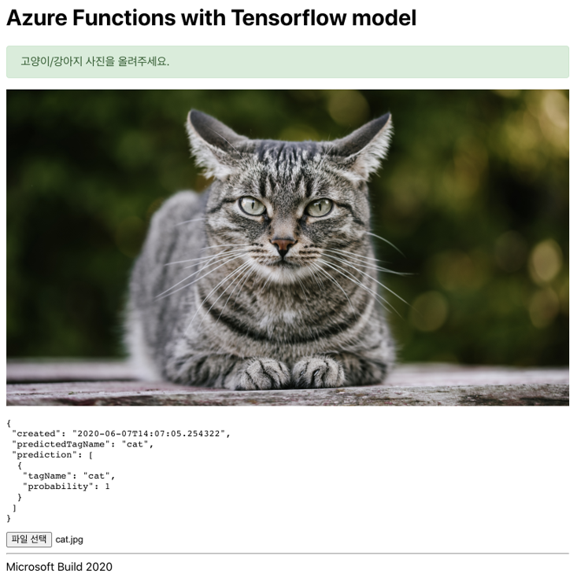

# Microsoft Build 2020 웹미나

공유링크 : https://bit.ly/build2020-webinar-reference

## 참고 프로젝트 : Dog or cat?

[Azure-Samples/functions-python-tensorflow-tutorial](https://github.com/Azure-Samples/functions-python-tensorflow-tutorial/tree/master/end/classify)


### Custom Vision 서비스 -> TF 모델로 내보내기


## Azure Functions 프로젝트

### predict.py는 Tensorflow 1.x 기준의 코드

Tensorflow 2.x에서는 아래 패치 코드가 필요

```python
import tensorflow as tf
tf.compat.v1.disable_v2_behavior()
```

```python
# graph_def = tf.GraphDef()
graph_def = tf.compat.v1.GraphDef()
```

### Jupyter Notebook을 활용한 모델 활용

* 필요한 라이브러리 설치 : `pip install "tensorflow~=2.2.0" jupyter`
    - 팁) pip 다운로드가 느리신 분들은 [카카오 미러를 설정](https://www.google.com/search?q=%EC%B9%B4%EC%B9%B4%EC%98%A4+%EB%AF%B8%EB%9F%AC+pypi)해보세요.
* Jupyter Notebook 구동 : jupyter notebook
* 다음 주소에서 다음 3개 파일 (predict.py, model.pb, labels.txt)을 같은 경로에 배치
    - https://github.com/Azure-Samples/functions-python-tensorflow-tutorial/tree/master/end/classify
* 같은 경로에 Notebook 파일 생성

```python
from predict import predict_image_from_url
from IPython.display import Image

cat_image_url = "https://ichef.bbci.co.uk/news/1024/branded_news/12A9B/production/_111434467_gettyimages-1143489763.jpg"
Image(url=cat_image_url, width=480)

predict_image_from_url(cat_image_url)
```

브라우저를 활용한 Jupyter Notebook


Visual Studio Code를 활용한 Jupyter Notebook


### Azure Functions에 Web API 만들기

1. 파이썬 3.7 이상 설치
2. Visual Studio Code 설치
3. Visual Studio Code 확장 설치
    - Python : `ms-python.python`
    - Azure Functions : `ms-azuretools.vscode-azurefunctions`
4. 명령 "Azure Functions: Install or Update Azure Functions Core Tools"
    - 수동 설치 : https://github.com/Azure/azure-functions-core-tools#installing
    - 윈도우 팩키지 매니저 Chocolately에서의 설치 : `choco install azure-functions-core-tools --params "'/x64'"`
    - 혹은 npm을 통한 설치 : `npm i -g azure-functions-core-tools@3 --unsafe-perm true`
5. 명령 "Azure Functions: Create New Project …"
    - 프로젝트 생성 + 파이썬 언어 선택 + 파이썬 버전 지정 + 가상환경 생성 및 활성화
6. 명령 "Python: Select Interpreter"을 통해 방금 생성한 `.venv` 가상환경 내 `Scripts/python.exe` 선택해서, VSCode가 생성한 가상환경을 바라보도록 해줍니다.
6. 필요한 팩키지를 requirements.txt에 나열

```
azure-functions
tensorflow~=2.2.0
pillow
requests
```

7. VS Code의 디버그 탭을 통해 "Attach to Python Functions" 실행
    - 필요한 팩키지가 자동으로 설치되고 나서, 서버 구동

### Werkzeug 라이브러리의 Form Parser가 활용

업로드된 파일에 접근하는 몇 가지 방법

```python
def main(req: func.HttpRequest) -> func.HttpResponse:
    req.files['photo']          # 방법#1) 단일 파일
    req.files.get('photo')      # 방법#2) 단일 파일
    req.files.getlist('photo')  # 방법#3) 같은 이름으로 다수 파일이 업로드될 경우, 리스트로 획득
```

참고

* [azure-functions-python-library](https://github.com/Azure/azure-functions-python-library)의 Http Trigger 구현에서 활용
* Werkzeug는 Flask 프레임워크에서 사용됩니다.

### Http Trigger 샘플 코드

* 위 Notebook에서 사용한 3개 파일 (predict.py, model.pb, labels.txt)을 같은 경로에 `HttpTrigger1` 폴더 안에 복사합니다.

```python
import logging
import json
import azure.functions as func
from PIL import Image
from .predict import _initialize, _predict_image

def predict_image_from_file(image_file):
    _initialize()
    image = Image.open(image_file)
    return _predict_image(image)

def main(req: func.HttpRequest) -> func.HttpResponse:
    logging.info(f"Python HTTP trigger function processed a request. : {req.method}")
    photo_list = req.files.getlist("photo")
    predict_list = [predict_image_from_file(photo) for photo in photo_list]
    # CORS 대응
    headers = {
        "Access-Control-Allow-Origin": "*",
        "Access-Control-Allow-Methods": "Get, Post, Options",
    }
    return func.HttpResponse(
        json.dumps(predict_list), mimetype="application/json", headers=headers
    )
```

### HTTPie를 활용한 요청 예시

```sh
$ pip install httpie

$ http --form http://localhost:7071/api/HttpTrigger1 photo@cat.jpg
```

### GitHub Codespaces

1. OS : 데비안 9 (stretch)
2. Python, Azure Functions 확장을 설치합니다.
3. azure-functions-core-tools 설치
    - `npm i -g azure-functions-core-tools@3 --unsafe-perm true`
4. python 명령은 파이썬 2.7, python3 명령은 파이썬 3.5이며, 그 외 버전은 `/opt/python/` 경로에 설치되어있습니다. 새로운 터미널을 열고, 다음과 같이 파이썬 3.7 가상환경을 생성하고 필요한 라이브러리를 설치합니다.

```sh
$ cd azure-functions
$ /opt/python/3.7/bin/python -m venv .venv
$ soruce .venv/bin/activate
(.venv) $ pip install -r requirements.txt
```

## 리액트 프로젝트



### 프로젝트 생성

```sh
yarn create react-app frontend
cd frontend
yarn add axios @emotion/core
yarn start
```
### 샘플 코드 적용

* frontend/App.js
* frontend/Photo.jsx
* frontend/useImageForm.js

## 감사합니다.

Life is short. You need Azure and Python.
